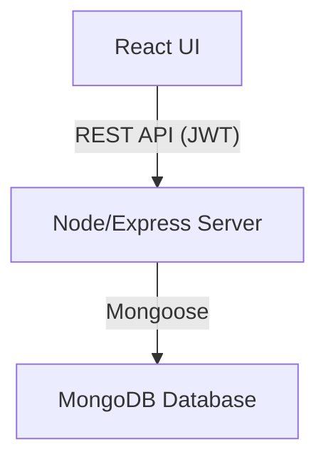
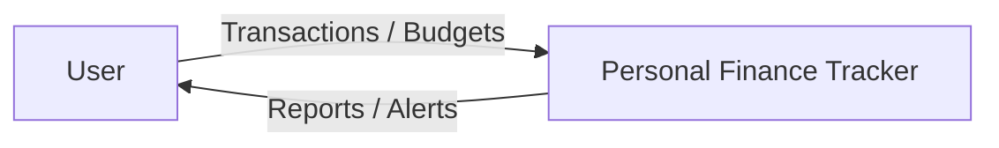
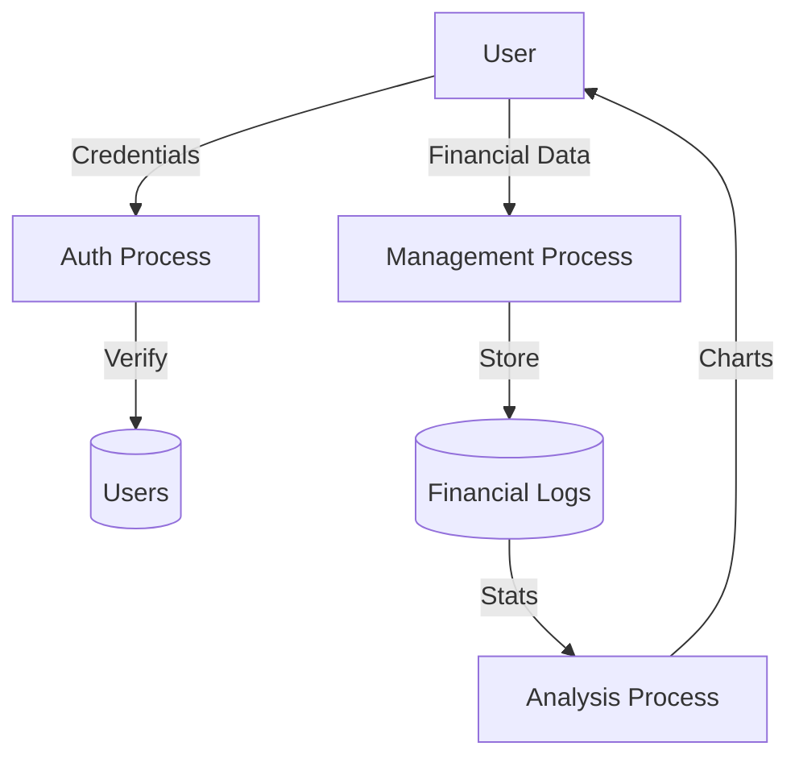
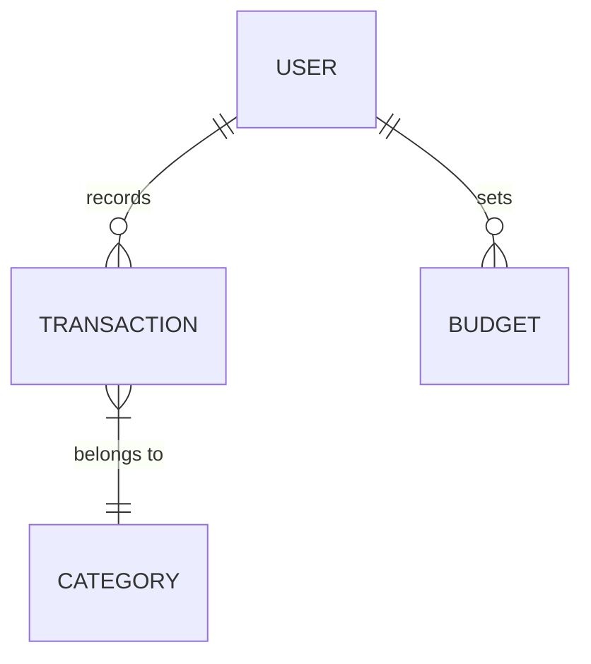

# Formal Project Report: Personal Finance Tracker using MERN Stack

---

## 1. Abstract
The systematic management of individual financial resources is a critical determinant of long-term financial security. This project presents a **"Personal Finance Tracker"** engineered using the **MERN Stack** (MongoDB, Express.js, React.js, and Node.js). This system integrates income management, expense tracking, savings monitoring, and proactive budget planning. By automating balance computations and generating interactive visual analytics, the platform empowers users to transition from passive tracking to active financial optimization.

---

## 2. Introduction
Personal Finance Management (PFM) involves the strategic process of managing money through purposeful budgeting and saving. In an era of fragmented spending, the ability to consolidate financial data into a single, cohesive view is essential. The **Personal Finance Tracker** provides a 360-degree view of financial health, including income tracking, savings monitoring, and strategic budget planning.

---

## 3. Problem Statement
Traditional manual methodologies are inadequate due to:
- **Arithmetic Inaccuracy**: Manual calculations lead to saving discrepancies.
- **Lack of Security**: Physical records are vulnerable to unauthorized access.
- **Poor Insights**: No visual identifiers of spending trends or budget variances.
- **Inaccessibility**: Limited ability to track and update records across devices.

---

## 4. Objectives
- **Secure Architecture**: JWT-based authentication for data privacy.
- **Integrated Management**: Unified dashboard for income, expenses, and savings.
- **Precision Calculations**: 100% accurate real-time balance computation.
- **Proactive Budgeting**: Setting and monitoring category-wise spending limits.
- **Visual Intelligence**: Graphical components for actionable financial insights.

---

## 5. System Modules
- **User Authentication**: Secure session management.
- **Income Management**: Capturing diverse revenue streams.
- **Expense Management**: Logging and categorizing expenditures.
- **Savings & Budgeting**: Tracking financial goals and limits.
- **Analytics & Reporting**: Generating visual trend feedback.

---

## 6. Technology Stack
- **Frontend**: React.js
- **Backend**: Node.js & Express.js
- **Database**: MongoDB (NoSQL)
- **Security**: JWT & Bcrypt

---

## 7. System Architecture Diagram

---

## 8. Data Flow Diagrams (DFD)

### DFD Level 0 (Context Diagram)

### DFD Level 1

---

## 9. ER Diagram

---

## 10. Database Design (MongoDB Schemas)

### Collection: Users
- `_id`: Unique Identifier
- `name`: User Full Name
- `email`: Registration Email
- `password`: Hashed Password

### Collection: Transactions
- `amount`: Monetary Value
- `type`: income / expense
- `category`: Classification Tag
- `userId`: Reference to User

### Collection: Budgets
- `category`: Targeted Category
- `limitAmount`: Spending Boundary
- `userId`: Reference to User

---

## 11. Conclusion
The **"Personal Finance Tracker using MERN Stack"** successfully fulfills the requirements of a modern, integrated financial management system. By providing a secure and analytical framework for income, savings, and budgeting, the system serves as a vital resource for achieving financial discipline and clarity.
